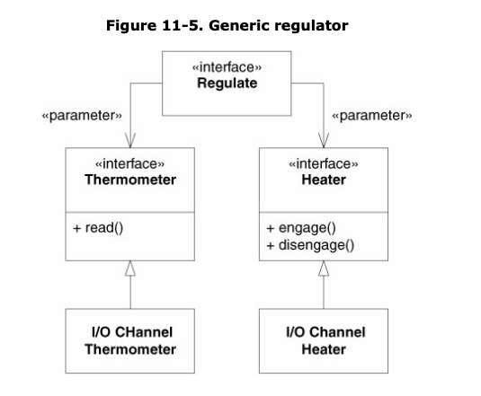

# Furnace Java Kata

> In this repository you'll find **Furnace Kata** an exercise based on the SOLID Principles. To be more precise is focused into the ISP Interface Segregation Principle and the DIP Dependency Inversion Principle. This exercise has been extracted and improves or extended from the book of "Agile Principles, Patterns, and Practices in C#" of Martin C. Robert and Martin Micah from the Chapter 11. If you're interested in the book you can check the link I left below where you can download the book in a PDF format.

> https://ivanderevianko.com/wp-content/uploads/2013/10/Agile-Principles-Patterns-and-Practices-in-C.pdf

## Table of Contents

1. [Motivation](#motivation)
1. [Used Technologies](#used-technologies)
1. [Reflections](#reflections)
1. [Furnace Diagram](#furnace-diagram)
1. [License](#license)

---

## Motivation

The motivation for this kata was based in advance the exercise at the same time you will be reading for the second time the chapter and advance your code. One time that you get to understand how the directory structure should be created and how to access the methods of one class to another by using interfaces you'll have achieved the main goal of this exercise. And the extra motivation if you thought it was too easy the exercise you can create another entity that will be a Jedi and you can program it to change the temperature of the room just using the real temperature of his/her ligthsaber.

---

**[⬆ back to top](#table-of-contents)**

## Used Technologies

- Java
- Junit
- Maven
- Jacoco
- MarkDown
- Github

---

**[⬆ back to top](#table-of-contents)**

## Reflections

This kata has helped me a lot to understand more concretely the DIP Principle, after this exercise everything seems to be really clearer than before. The biggest difficulty I've found to realize by a correct way this exercise was applied correctly the comportment of the objects by applying to each one the right interface and after to access the methods I wanted to use. How I said the hardest part was not trying to develop the logic of the program, but it was understanding how apply the DIP Principle like Robert C. Martin could have done. This was an enjoyable kata and a pleasant way to learn accompanied by a really good book with detailed explanations that will make your process a lot easier than just making a deep research into the network browser. In case you don't want to try this exercise I'll recommend you to read the chapter of the book related to the DIP Principle if you're interested in to the SOLID Principles.

---

**[⬆ back to top](#table-of-contents)**

## Furnace Diagram

> This UML Diagram has been extracted from the book https://ivanderevianko.com/wp-content/uploads/2013/10/Agile-Principles-Patterns-and-Practices-in-C.pdf

---

**[⬆ back to top](#table-of-contents)**

## License

MIT License

Copyright (c) 2020 AntoniPizarro and Pau Llinàs

Permission is hereby granted, free of charge, to any person obtaining a copy
of this software and associated documentation files (the "Software"), to deal
in the Software without restriction, including without limitation the rights
to use, copy, modify, merge, publish, distribute, sublicense, and/or sell
copies of the Software, and to permit persons to whom the Software is
furnished to do so, subject to the following conditions:

The above copyright notice and this permission notice shall be included in all
copies or substantial portions of the Software.

THE SOFTWARE IS PROVIDED "AS IS", WITHOUT WARRANTY OF ANY KIND, EXPRESS OR
IMPLIED, INCLUDING BUT NOT LIMITED TO THE WARRANTIES OF MERCHANTABILITY,
FITNESS FOR A PARTICULAR PURPOSE AND NONINFRINGEMENT. IN NO EVENT SHALL THE
AUTHORS OR COPYRIGHT HOLDERS BE LIABLE FOR ANY CLAIM, DAMAGES OR OTHER
LIABILITY, WHETHER IN AN ACTION OF CONTRACT, TORT OR OTHERWISE, ARISING FROM,
OUT OF OR IN CONNECTION WITH THE SOFTWARE OR THE USE OR OTHER DEALINGS IN THE
SOFTWARE.

---

**[⬆ back to top](#table-of-contents)**
